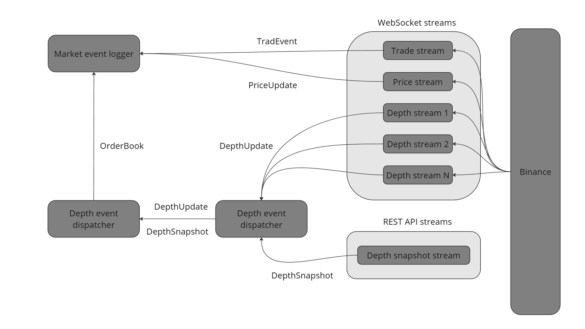

# Market Depth Capture tool (MDC)

MDC is a utility for capturing and logging market data from the Binance exchange. It opens streams for trades, prices, and order book updates, with multiple WebSocket connections for depth updates and a separate connection for snapshots.

## Building and Usage

### Development Environment Setup

MDC uses a development container for consistent development environments. To set up the development environment:

1. Ensure you have Docker and (VS Code|Rust Rover) with the DevContainers extension installed.
2. Open the project folder.
3. When prompted, click "Reopen in Container" and select container.
4. The container will be built and the project dependencies will be installed automatically.

Alternatively, you can build the project locally:

```bash
cargo build
```

### Building the Release Artifact

To build a Docker image for deployment:

```bash
docker build -t mdc:latest .
```

This creates a minimal Docker image with the MDC binary and its runtime dependencies.

### Running the Application

#### Running Locally

To run the application locally:

```bash
# Run with default configuration
cargo run

# Run with a specific configuration file
cargo run -- --config path/to/config.yaml

# Run with a specific log level
cargo run -- --log-level debug
```

#### Running in Docker

To run the application in Docker:

```bash
# Run with default configuration
docker run -it mdc:latest

# Run with a custom configuration file (mounted from host)
docker run -it -v /path/to/your/config.yaml:/etc/mdc.yaml mdc:latest

# Run with custom command-line arguments
docker run -it mdc:latest mdc --config /etc/mdc.yaml --log-level debug
```

### Command-Line Parameters

MDC accepts the following command-line parameters:

| Parameter     | Short | Description                                     | Default    |
|---------------|-------|-------------------------------------------------|------------|
| `--config`    | `-c`  | Path to the configuration file                  | `mdc.yaml` |
| `--log-level` | `-l`  | Logging level (trace, debug, info, warn, error) | `info`     |

Example:

```bash
mdc --config custom-config.yaml --log-level debug
```

### Configuration

MDC uses a YAML configuration file with the following parameters:

| Parameter                  |                          Description                       |                Example              |
|----------------------------|------------------------------------------------------------|-------------------------------------|
| `binance_rest_endpoint`    | Binance REST API endpoint for snapshots                    | `https://api.binance.com/api/v3/`   |
| `binance_wss_endpoint`     | Binance WebSocket endpoint for real-time updates           | `wss://stream.binance.com:9443/ws/` |
| `instrument`               | Instrument to monitor                                      | `BTCUSDT`                           |
| `max_depth`                | Maximum depth of the order book (up to 5000)               | `100`                               |
| `connections`              | Number of parallel WebSocket connections for depth updates | `3`                                 |
| `reconnect_timeout`        | WebSocket reconnection timeout in milliseconds             | `5000`                              |
| `snapshot_update_interval` | Interval between snapshot requests in milliseconds         | `5000`                              |

Example configuration file:

```yaml
binance_rest_endpoint: "https://api.binance.com/api/v3/"
binance_wss_endpoint: "wss://stream.binance.com:9443/ws/"
instrument: "BTCUSDT"
max_depth: 100
connections: 3
reconnect_timeout: 5000
snapshot_update_interval: 5000
```

## Internal Structure

### Components

MDC consists of the following main components:

1. **MarketEventStream**: Establishes and maintains WebSocket connections to Binance, processes incoming messages, and forwards them to the appropriate channels.

2. **DepthSnapshotStream**: Periodically requests order book snapshots from the Binance REST API and sends them to the DepthEventDispatcher.

3. **DepthEventDispatcher**: Ensures that depth updates are processed in the correct order and without duplicates. It maintains a buffer of updates and processes them in sequence based on their update IDs.

4. **BookProcessor**: Maintains the state of the order book by applying depth updates and snapshots. It sends the updated order book to the MarketEventLogger.

5. **OrderBook**: A data structure that maintains the state of the order book, tracking bid and ask orders at various price levels.

6. **MarketEventLogger**: Logs market events (trades, prices, and order books) to stdout.

### Data Flow

The data flow in MDC follows this pattern:



1. Multiple MarketEventStream instances connect to Binance WebSocket API to receive depth updates, trade events, and price updates.
2. DepthSnapshotStream periodically requests order book snapshots from the Binance REST API.
3. Depth updates and snapshots are sent to the DepthEventDispatcher, which ensures they are processed in the correct order.
4. The BookProcessor applies the updates to the OrderBook and sends the updated OrderBook to the MarketEventLogger.
5. Trade events and price updates are sent directly to the MarketEventLogger.
6. The MarketEventLogger logs all events to stdout.